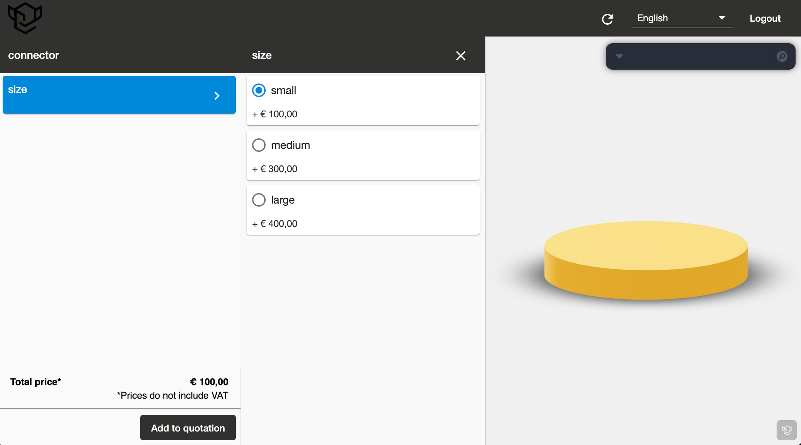

A collection of self-contained mini examples showing various features of Buerli, and how to employ them in a React context.

First, clone the repository.

```shell
git clone https://github.com/awv-informatik/buerli-starter
cd buerli-starter
yarn
```

Visit [https://buerli.io](https://buerli.io), sign in, download your `*.ccapp` file and place it into the `/classcad` folder, rename it `modeling.ccapp`. Now you can start the docker classcad service.

```shell
cd classcad
docker compose -f docker-compose.yml up --build
```

Open another shell, navigate to the `/buerli-starter` folder, start the dev server.

```shell
yarn run dev
```

All examples inside `/packages` are self contained and can be ran and forked individually!

## Starters

<p>
  <a href="https://github.com/awv-informatik/buerli-starter/tree/main/packages/with-history-run"></a>
  <a href="https://github.com/awv-informatik/buerli-starter/tree/main/packages/with-history-cache"></a>
  <a href="https://github.com/awv-informatik/buerli-starter/tree/main/packages/with-history-cache-as1ac214-jsx"></a>
  <a href="https://github.com/awv-informatik/buerli-starter/tree/main/packages/with-history-cache-elfsquad"></a>
  <a href="https://github.com/awv-informatik/buerli-starter/tree/main/packages/with-history-cache-robot"></a>
  <a href="https://github.com/awv-informatik/buerli-starter/tree/main/packages/with-solid-cache"></a>
  <a href="https://github.com/awv-informatik/buerli-starter/tree/main/packages/with-solid-cache-reuse"></a>
</p>

## API

You create a headless connection to Buerli by calling `headless` with an implementation and a url. The implementation is either `history` or `solid`. The url is the websocket url of the Buerli server.

```tsx
type HeadlessConfig = Partial<BuerliState['options']> & {
  /** Buerli socket adapter, default: SocketIOClient */
  socket?: new (...args: any) => AwvNodeClient
  /** Suspense entry invalidation in ms, default: 0 (keep-alive forever) */
  lifespan?: number
  /** Suspense cache equality function, default: (a, b) => a === b (reference equality) */
  equal?: (a: any, b: any) => boolean
  /** An object that can persist values for the lenght of the session */
  store?: { [key: string]: any }
}

headless(impl: typeof solid | typeof history, url: string, config: HeadlessConfig = {})
```

For instance:

```jsx
import { headless } from '@buerli.io/react'
import { history } from '@buerli.io/headless'

const buerli = headless(history, 'ws://localhost:9091')
```

### Using the API

The `headless` function returns an object with two functions: `run` and `cache`.

- use `run` when the server keeps your state and you want to reflect whatever the server is doing.
- use `cache` when you keep state on the client and you are using the server as a computation engine.

#### Run

Use `run` when your app wants to reflect server state. Calling `run` will execute an async script on the server, the result of which is rendered with an additional `<BuerliGeometry>` component.

```jsx
import { BuerliGeometry, headless } from '@buerli.io/react'
import { history } from '@buerli.io/headless'

// Create a connection to buerli, destruct `run`
const { run } = headless(history, 'ws://localhost:9091')

function Scene({ width = 100 }) {
  useEffect(() => {
    // Run an async script computing a boolean between two cylinders on the server
    run(async api => {
      const part = await api.createPart('Part')
      const wcsy = await api.createWorkCoordSystem(part, 8, [], [], [0, width / 3, 0], [Math.PI / 3, 0, 0])
      const wcsx = await api.createWorkCoordSystem(part, 8, [], [], [0, -width / 5, -width / 8], [0, 0, 0])
      const a = await api.cylinder(part, [wcsx], 10, width)
      const b = await api.cylinder(part, [wcsy], 10, width)
      await api.boolean(part, 0, [a, b])
    })
  }, [])
  // Render whatever the server returns
  return <BuerliGeometry />
}
```

The optional `suspend` option would allow you to await results inside useEffect and useLayoutEffect.

```jsx
useLayoutEffect(() => {
  // You can access the scene graph *before* it is rendered on screen here ...
  // This works because buerli geometry suspends.
  ref.current.traverse(child => {
    // Make all meshes orange
    if (obj.type === 'Mesh') {
      obj.material = new THREE.MeshStandardMaterial({ color: 'orange', roughness: 0.5 })
    }
  })
})

return <BuerliGeometry suspend />
```

#### Cache

Use `cache` when the result of the operations you send to buerli are deterministic, for instance if you are constructing a geometry from a set of parameters that will always result in the same shape.

`cache` uses [React.suspense](https://react.dev/reference/react/Suspense) and returns a result, which is cached and memoized. The results can be displayed in whichever way you like, for instance returning a geometry and adding it to a mesh.

```jsx
import { BuerliGeometry, headless } from '@buerli.io/react'
import { history } from '@buerli.io/headless'

// Create a connection to buerli, destruct `cache`
const { cache } = headless(history, 'ws://localhost:9091')

function Scene({ width = 100 }) {
  // Execute an async script on the server and cache the resulting geometry using "width" as a cache key
  // Given the same width, the geometry will be reused without involving buerli again, not just in this
  // components but in all components that use the same cache key.
  const geo = cache(
    async api => {
      const part = await api.createPart('Part')
      const wcsy = await api.createWorkCoordSystem(part, 8, [], [], [0, width / 3, 0], [Math.PI / 3, 0, 0])
      const wcsx = await api.createWorkCoordSystem(part, 8, [], [], [0, -width / 5, -width / 8], [0, 0, 0])
      const a = await api.cylinder(part, [wcsx], 10, width)
      const b = await api.cylinder(part, [wcsy], 10, width)
      const solid = await api.boolean(part, 0, [a, b])
      return await api.createBufferGeometry(solid)
    },
    [width],
  )
  // Suspense will interrupt (/"suspend") the component until the script is finished
  // The result, which is a geometry in this case, can now be used and displayed directly
  return (
    <mesh geometry={geo}>
      <meshStandardMaterial />
    </mesh>
  )
}
```
