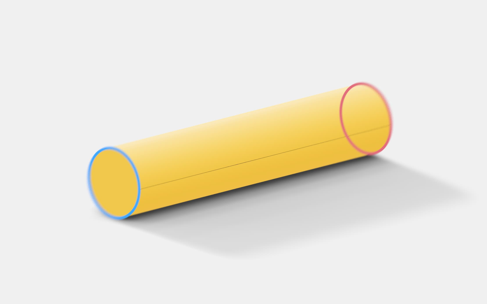
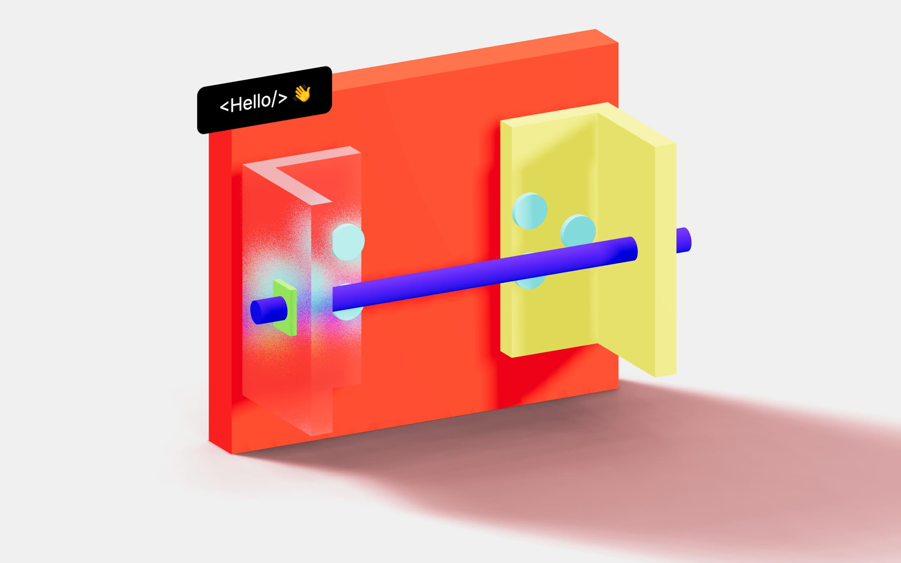
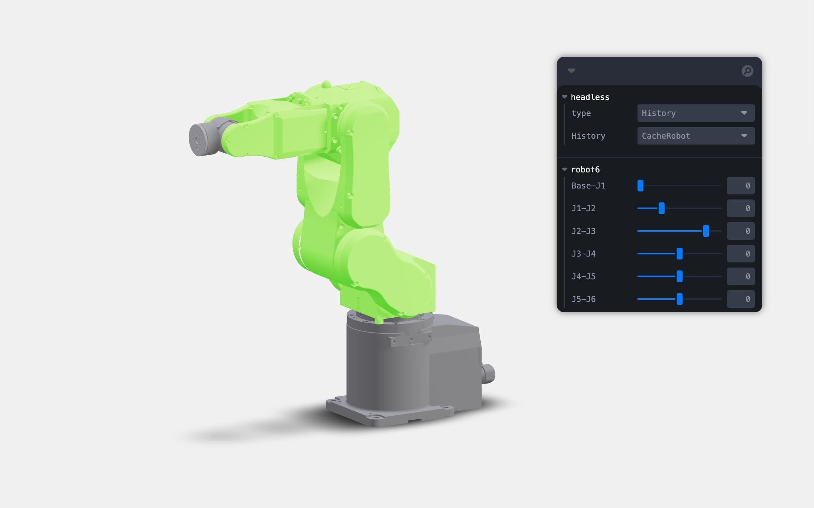
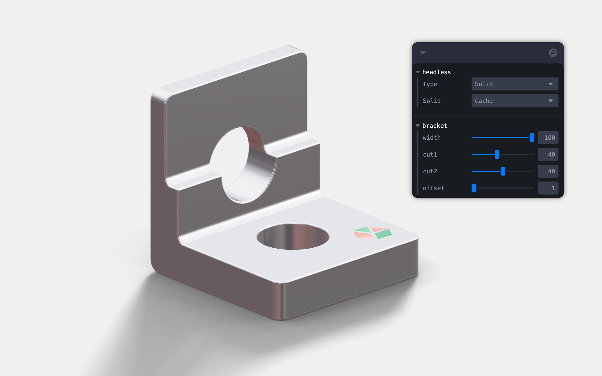
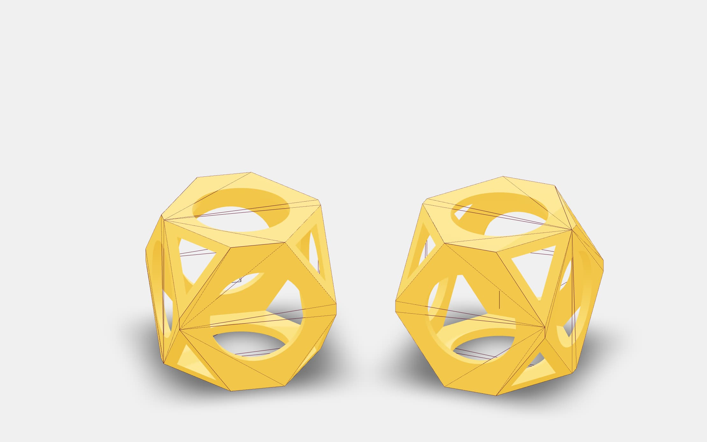

A collection of self-contained mini examples showing various features of Buerli, and how to employ them in a React context.

First, clone the repository.

```shell
git clone https://github.com/awv-informatik/buerli-starter
cd buerli-starter
```

Place your modeling.ccapp file into the /classcad folder and docker-compose up. Now run:

```shell
yarn
yarn run dev
```

All examples inside /packages are self contained and can be run and forked individually!

### Starters

<p>
  <a href="https://github.com/awv-informatik/buerli-starter/tree/main/packages/with-history-run"></a>
  <a href="https://github.com/awv-informatik/buerli-starter/tree/main/packages/with-history-cache"></a>
  <a href="https://github.com/awv-informatik/buerli-starter/tree/main/packages/with-history-cache-as1ac214-jsx"></a>
  <a href="https://github.com/awv-informatik/buerli-starter/tree/main/packages/with-history-cache-robot"></a>
  <a href="https://github.com/awv-informatik/buerli-starter/tree/main/packages/with-solid-cache"></a>
  <a href="https://github.com/awv-informatik/buerli-starter/tree/main/packages/with-history-solid-reuse"></a>
</p>

### API

```tsx
type HeadlessConfig = Partial<BuerliState['options']> & {
  /** Buerli socket adapter, default: SocketIOClient */
  socket?: new (...args: any) => AwvNodeClient
  /** Suspense entry invalidation in ms, default: 0 (keep-alive forever) */
  lifespan?: number
  /** Suspense cache equality function, default: (a, b) => a === b (reference equality) */
  equal?: (a: any, b: any) => boolean
  /** An object that can persist values for the lenght of the session */
  store?: { [key: string]: any }
}

headless(impl: typeof solid | typeof history, url: string, config: HeadlessConfig = {})
```

#### Run

Either use `run` which merely executes and `<BuerliGeometry>` to display the results asynchroneously (although the `suspend` option would allow you to orchestrate inside useEffect and useLayoutEffect).

```jsx
import { BuerliGeometry, headless } from '@buerli.io/react'
import { history } from '@buerli.io/headless'

const { run } = headless(history, 'ws://localhost:9091')

function Scene({ width = 100 }) {
  useEffect(() => {
    run(async (api, store) => {
      const part = await api.createPart('Part')
      const wcsy = await api.createWorkCoordSystem(part, 8, [], [], [0, width / 3, 0], [Math.PI / 3, 0, 0])
      const wcsx = await api.createWorkCoordSystem(part, 8, [], [], [0, -width / 5, -width / 8], [0, 0, 0])
      const a = await api.cylinder(part, [wcsx], 10, width)
      const b = await api.cylinder(part, [wcsy], 10, width)
      await api.boolean(part, 0, [a, b])
      // You can put anything into the store and use it in consecutive run calls
      store.part = part
    })
  }, [])
  return <BuerliGeometry suspend />
}
```

#### Cache

Or use `cache` which suspends and returns the result of the function as a cached and memoized value. The results can be displayed in whichever way you like, for instance returning a geometry and adding it to a mesh right away.

The dependecies are cache keys. Similar to a useMemo the inner function is called when the cache keys change. The dependencies are also passed to the inner function, so you could hoist it.

```jsx
import { BuerliGeometry, headless } from '@buerli.io/react'
import { history } from '@buerli.io/headless'

const { cache } = headless(history, 'ws://localhost:9091')

function Scene({ width = 100 }) {
  const geo = cache(
    async (api, store, ...args) => {
      const part = await api.createPart('Part')
      const wcsy = await api.createWorkCoordSystem(part, 8, [], [], [0, width / 3, 0], [Math.PI / 3, 0, 0])
      const wcsx = await api.createWorkCoordSystem(part, 8, [], [], [0, -width / 5, -width / 8], [0, 0, 0])
      const a = await api.cylinder(part, [wcsx], 10, width)
      const b = await api.cylinder(part, [wcsy], 10, width)
      const solid = await api.boolean(part, 0, [a, b])
      return await api.createBufferGeometry(solid)
    },
    [width],
  )
  return (
    <mesh geometry={geo}>
      <meshStandardMaterial />
    </mesh>
  )
}
```

### Typescript

All input and output types are correctly inferred.

```tsx
const { cache } = headless(history, 'ws://localhost:9091', { store: { foo: 'bar' } })

function Foo() {
  const baz = cache(
    async (api, store, dep1, dep2, ...rest) => {
      // typeof api === typeof ApiHistory
      // typeof store === { foo: string }
      // typeof dep1 === string
      // typeof dep2 === number
      // typeof rest === [boolean, { hello: string }]
      const part = api.createPart('foo')
      // typeof part === typeof ID
      return store.foo
    },
    ['hi', 1, true, { hello: 'world' }],
  )
  // typeof baz === string
}
```
