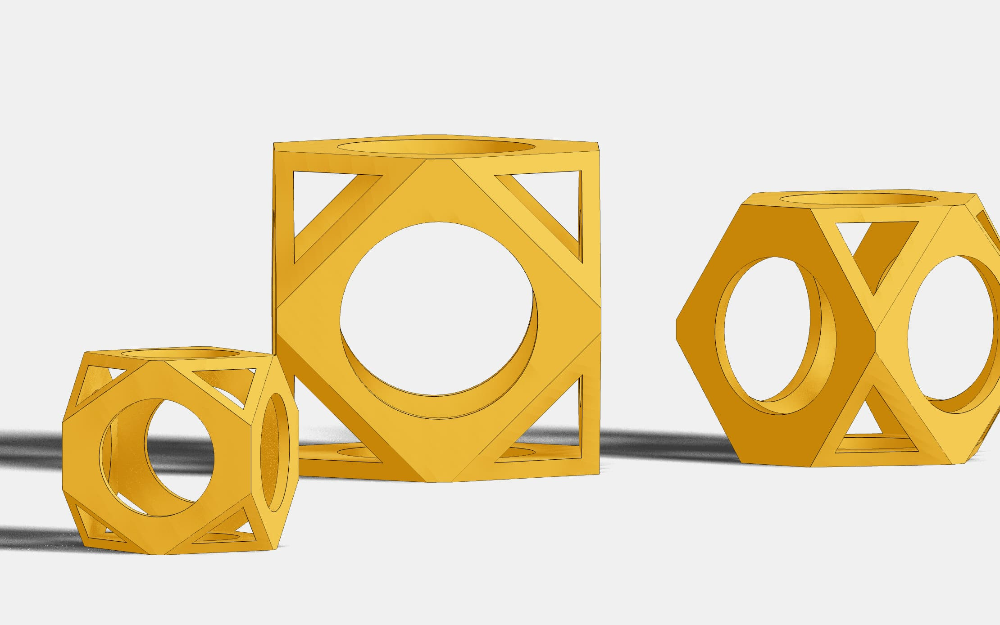

# buerli-starter

A collection of self-contained mini examples showing various features of Buerli, and how to employ them in a React context.

First, clone the repository.

```shell
git clone https://github.com/awv-informatik/buerli-starter
cd buerli-starter
yarn
```

### Create an account and get your ClassCAD key

In order for **buerli-starter** to work, you need to have a running ClassCAD. You can either run it in the browser using WASM or connect to a local or remote ClassCAD server using SocketIO.

### Running ClassCAD using WASM

Follow the instruction points 1-3 about **"Create an account and get your ClassCAD key"** on [Getting Started with WASM](https://buerli.io/docs/quickstart/wasm).

Copy your created ClassCAD WASM key into the .env file at `CLASSCAD_WASM_KEY=` in the root of this project. The variable `SOCKETIO_URL` is not relevant in this case.

> The first time ClassCAD starts using WASM, loading may take some time depending on your internet speed.

```shell
CLASSCAD_WASM_KEY=MS4xLlZZUG51....
SOCKETIO_URL=ws://localhost:9091
```

### Running ClassCAD using SocketIO

Follow the instruction points 1-3 about **"Create an account, get your ClassCAD key, download ClassCAD"** on [Getting Started with SocketIO](https://buerli.io/docs/quickstart/socketio)

Start ClassCAD via SocketIO as described in the [Downloads](https://classcad.ch/downloads/) page

Open the .env file in the root of this project and comment out `CLASSCAD_WASM_KEY` to make sure ClassCAD is not running using WASM

```shell
#CLASSCAD_WASM_KEY=MS4xLlZZUG51....
SOCKETIO_URL=ws://localhost:9091
```

### Run the examples

```shell
yarn dev
```

All examples inside `/packages` are self contained and can be ran and forked individually! You will have to insert your ClassCAD key in each example's `main.jsx` file in that case.

## Starters

<p>
  <a href="https://github.com/awv-informatik/buerli-starter/tree/main/packages/with-part-run"></a>
  <a href="https://github.com/awv-informatik/buerli-starter/tree/main/packages/with-part-cache"></a>
  <a href="https://github.com/awv-informatik/buerli-starter/tree/main/packages/with-assembly-cache-as1ac214-jsx"></a>
  <a href="https://github.com/awv-informatik/buerli-starter/tree/main/packages/with-assembly-pipes"></a>
  <a href="https://github.com/awv-informatik/buerli-starter/tree/main/packages/with-assembly-cache-robot"></a>
  <a href="https://github.com/awv-informatik/buerli-starter/tree/main/packages/with-solid-cache"></a>
  <a href="https://github.com/awv-informatik/buerli-starter/tree/main/packages/with-solid-cache-reuse"></a>
  <a href="https://github.com/awv-informatik/buerli-starter/tree/main/packages/with-stepviewer"></a>
</p>

### Links to our homepages and documentations

- [buerligons.io](https://buerligons.io)
- [buerli.io](https://buerli.io)
- [classcad.ch](https://classcad.ch)
- [awv-informatik.ch](https://awv-informatik.ch)