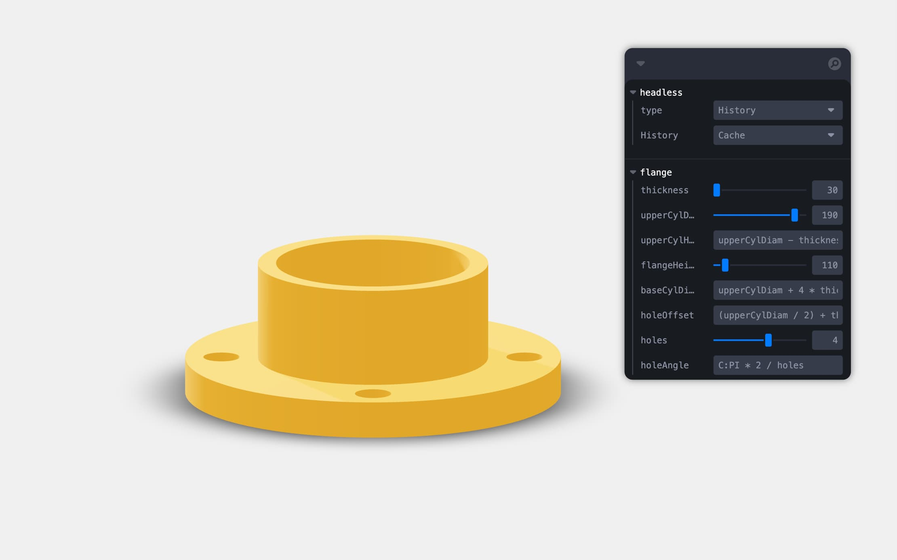

A collection of self-contained mini examples showing various features of Buerli, and how to employ them in a React context.

First, clone the repository.

```shell
git clone https://github.com/awv-informatik/buerli-starter
cd buerli-starter
yarn
```

Visit [https://buerli.io](https://buerli.io/docs/quickstart/wasm) for installation instructions and API documentation.

### Create an account and get your ClassCAD key

1 — Visit ClassCAD and create an account.
2 — Get your ClassCAD key from the same user page, pick a WASM key.
3 — You will be asked to provide allowed origins, type: http://localhost:3000/

### Open the app entrypoint (App.tsx) of any example and insert your ClassCAD key

```jsx
const classcadKey = '...'
init(did => new WASMClient(did, { classcadKey }), { elements, globalPlugins: [Measure] })
```

### Run the examples

```shell
yarn dev
```

All examples inside `/packages` are self contained and can be ran and forked individually!

## Starters

<p>
  <a href="https://github.com/awv-informatik/buerli-starter/tree/main/packages/with-history-run"></a>
  <a href="https://github.com/awv-informatik/buerli-starter/tree/main/packages/with-history-cache"></a>
  <a href="https://github.com/awv-informatik/buerli-starter/tree/main/packages/with-history-cache-as1ac214-jsx"></a>
  <a href="https://github.com/awv-informatik/buerli-starter/tree/main/packages/with-history-cache-elfsquad"></a>
  <a href="https://github.com/awv-informatik/buerli-starter/tree/main/packages/with-history-cache-robot"></a>
  <a href="https://github.com/awv-informatik/buerli-starter/tree/main/packages/with-solid-cache"></a>
  <a href="https://github.com/awv-informatik/buerli-starter/tree/main/packages/with-solid-cache-reuse"></a>
</p>
