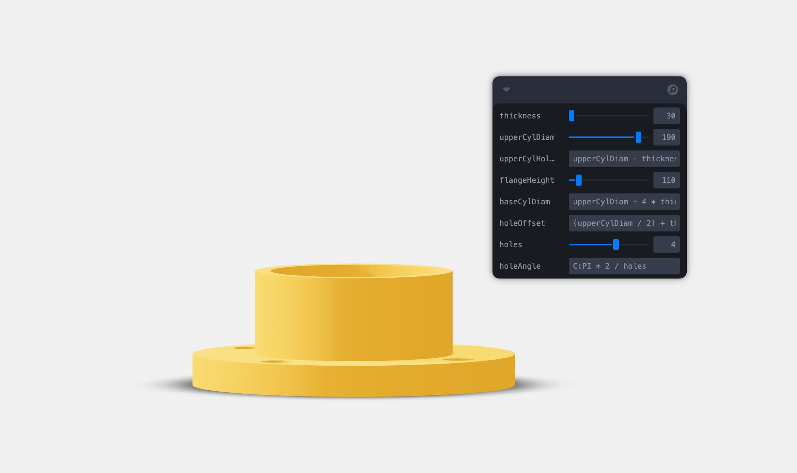

<br />

```shell
git clone https://github.com/awv-informatik/buerli-starter
cd buerli-starter
npm install
npm run with-headless-history-cache
```

This example shows how to use headless/history/cache with direct, declarative access to resulting geometries.

`cache` allows you to execute commands with React suspense integration, and then access the results. This makes it easy to maintain full control over view, your meshes, adding events, etc.

At the same time you have control over the loading and pending state. Loading fallbacks are controlled via React.Suspense, pending state is controlled via React.useTransition. Pending is meant to unblock the UI, it will leave the current result on screen even while a new requests have been made and are currently suspending.

### References

- [Suspense](https://react.dev/reference/react/Suspense)
- [useTransition](https://react.dev/reference/react/useTransition)
